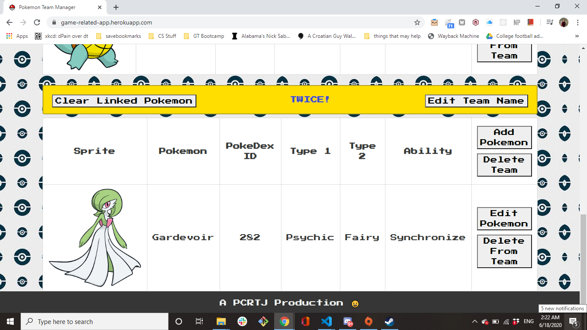

# PokeTeam Manager. 

 ## Contributing Authors: 
 Chidi Uwakwe, John Senak, Pallavi Nama, Tucker Hembree, and Ricardo Russ 

 ## Project Name:
 PokeTeam Manager

 ## Description:
 This project is a Pokemon Team Manager, which uses the existing PokeAPI to build a tool that allows you to build a standard competitive Pokemon team! 

 ## Table of Contents: 
 # Installation 
 # Usage 
 # License 
 # Contributing Authors 
 # Tests 
 # Miscellaneous 

 ## Installation Instructions:
 This project does not require user installation, as the functionality of the website mostly works through calls to our hosted server.

 ## Usage Instructions:
 To use the PokeTeam Manager, the user will first be brought to a page with a list of teams that have already been added to our database. Upon loading this page, the user will see a list of tables with team names assigned to them, along with a navbar with various options. The teams are organized into a series of tables which feature buttons to edit a team, add a pokemon, or edit pokemon. Upon adding a team, it will initially be empty, so the user can select the add pokemon button to add pokemon first to the database of stored pokemon on the site,using a call to the PokeAPI, and then from that database, they can then add a selected pokemon to a specific team, using the Add Pokemon to Team button located on the view all Pokemon page. 

 ## License:
 ISC 

## Screenshots:

 ## Tests:
 N/a

 ## Miscellaneous:
 Made with Love!

 Badge:
 https://img.shields.io/badge/Current-Maintained-red.svg)(https://shields.io/) 

  
